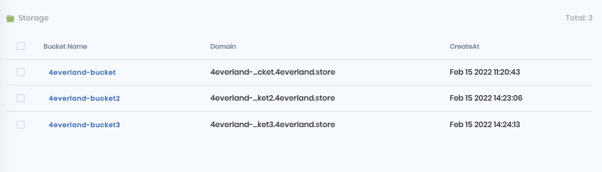

# View Details

## Bucket List

You can view the list of all the buckets you have created on the bucket homepage, as well as the domain of the bucket.

## File Info

You can also get a detailed view of all the information about an individual file, including an image preview, file name and size, object URL, IPFS hash, and the last time it was edited. You can view your bucket files via Bucket or directly on the IPFS gateway.

To view the CID of a fixed IPFS on the IPFS gateway.

To view the file URL

