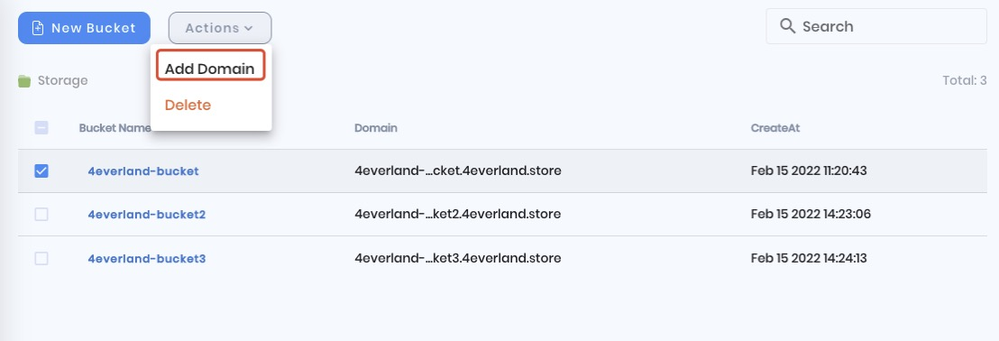
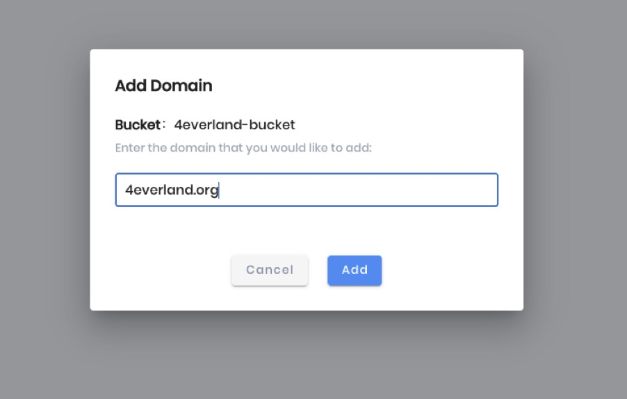
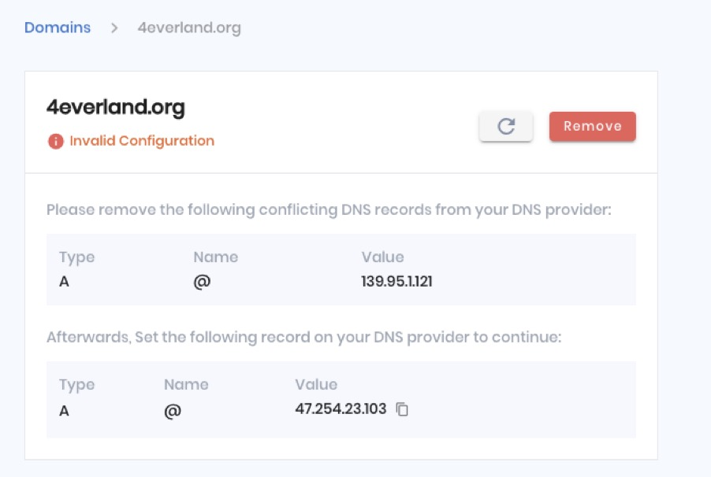
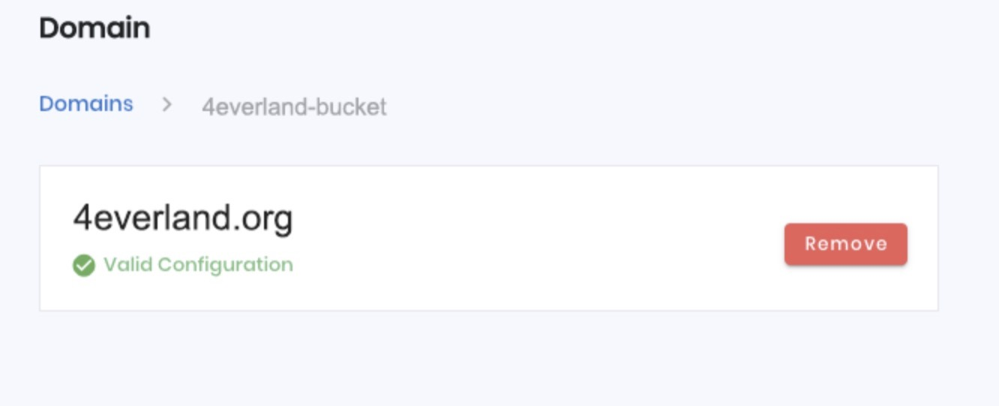
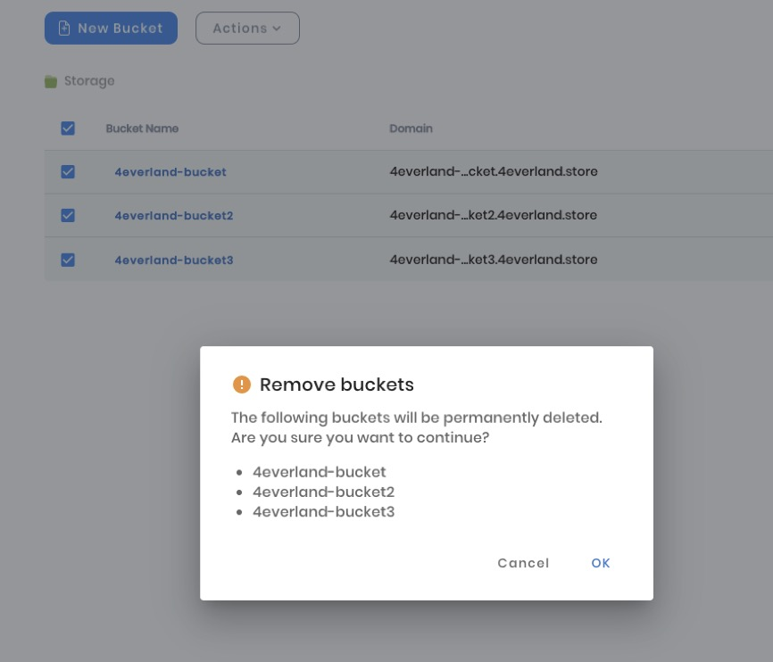
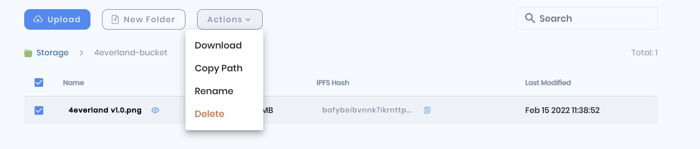

# More Actions

## Add Domain

1. To add a domain. Select a bucket you want to add a domain to and then click on "Add Domain" button then press enter.

2. Before you enter the domain that you would like to add, please make sure that the domain name is available.

3. The domain you added must be validated before it is bound to a bucket. Enter the correct Type, Name, and Value into the domain provider's backend, to validate them.

4. The domain status bar will turn green if the DNS is successfully validated, indicating that the domain has been successfully bound and you can access your bucket via the bound domain.

## Delete Bucket

To delete buckets. You can delete buckets in bulk, but if the bucket has other files, you should delete these files first before you delete buckets in bulk.

## File Actions

For an individual file. These four actions are available. You can download files locally, copy path, rename, and also delete files in bulk.

## Contact Us

Follow these steps to upload, pin, fetch and delete files to 4EVERLAND Bucket via the IPFS system. Feel free to contact us, we'd be happy to help you set up and run your website smoothly. So, please contact us via our [email](contact@4everland.org), [website](https://bucket.4everland.org), [Community Chat](https://discord.gg/Cun2VpsdjF), or [Twitter](https://twitter.com/4everland_org)
