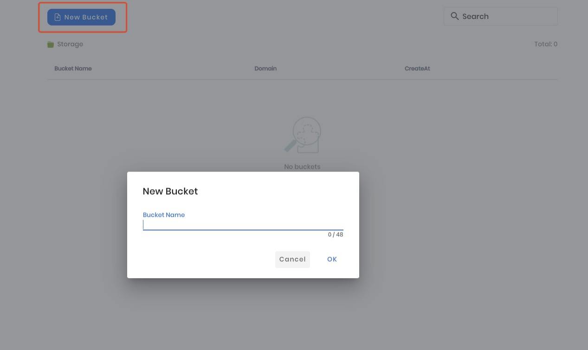
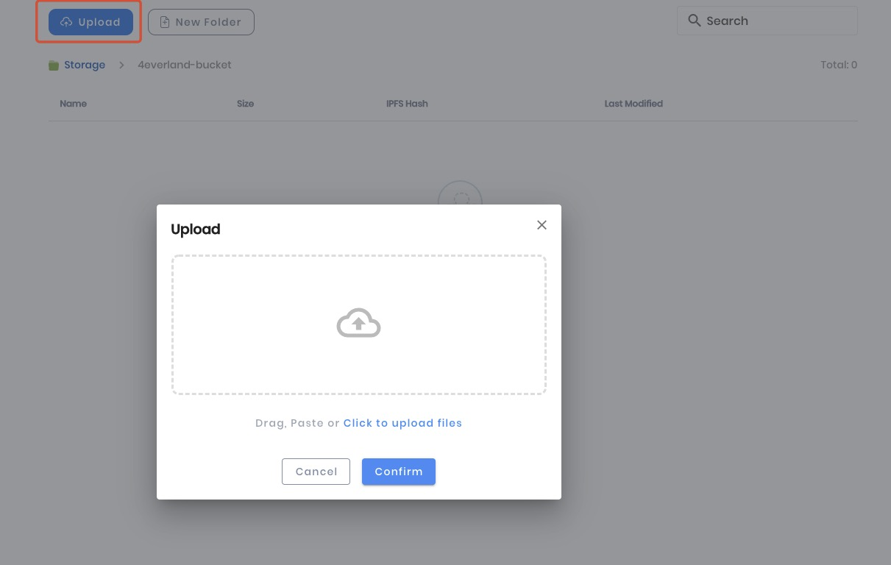

# Login and Upload

## Step1: Login

You can login to bucket via two ways, connect wallet or Github. If you register after February 15th, you will only be able to login using the wallet.

## Step2: Create Bucket

Click on the "New Bucket" button in the top left corner, enter a bucket name to create your bucket. Then the system will give the domain name to your website automatically.

## Step3: Upload Files

After this select the bucket you just created, then click on the 'upload' button which will open the upload pop-up window. You can browse folders and files directly from your Finder or drag and drop them into the pop-up window.

